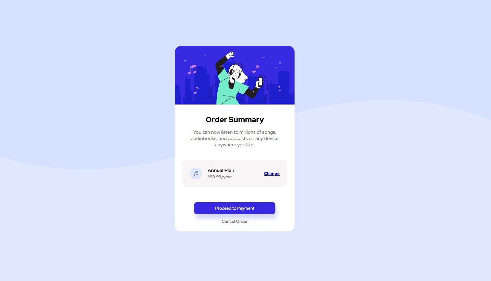

# Frontend Mentor - Order summary card solution

This is a solution to the [Order summary card challenge on Frontend Mentor](https://www.frontendmentor.io/challenges/order-summary-component-QlPmajDUj). Frontend Mentor challenges help you improve your coding skills by building realistic projects.

## Table of contents

- [Overview](#overview)
  - [The challenge](#the-challenge)
  - [Screenshot](#screenshot)
  - [Gif](#gif)
- [My process](#my-process)
  - [Built with](#built-with)
  - [What I learned](#what-i-learned)
  - [Continued development](#continued-development)
- [Author](#author)

**Note: Delete this note and update the table of contents based on what sections you keep.**

## Overview

The challenge is to build out this order summary card component and get it looking as close to the design as possible.
style guide has been given. I just added other style that I think is as close to the original design.

### The challenge

Users should be able to:

- See hover states for interactive elements

### Screenshot

### Gif

## My process

Since the style is give.

- I started with html
- I then move into css

### Built with

- Semantic HTML5 markup
- CSS custom properties
- Flexbox
- CSS Grid
- Mobile-first workflow

### What I learned

This challenge help me practice flexbox layout.

### Continued development

I need to continue developing my @media query.

## Author

- Github - [goldreb](https://github.com/goldreb)
- Frontend Mentor - [@goldreb](https://www.frontendmentor.io/profile/goldreb)
- Twitter - [@goldspycoder](https://www.twitter.com/yourusername)
